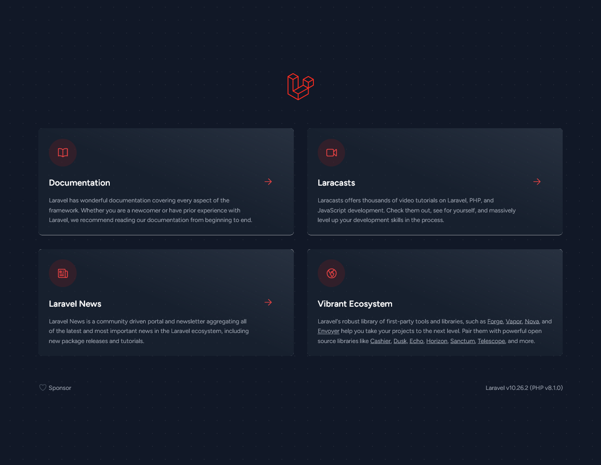

# Laravel con Nginx e MySQL

## Disclaimer

La versione presente nel libro utilizzava la versione PHP 7.2 e presentava un bug.

Questa versione è aggiornata alla versione php:8.1.0 e testata.

## Installazione

```
docker-compose build

docker-compose up -d
```

Accedere alla pagina http://localhost per visualizzare la pagina dell'applicazione:



## Add-on: post-installazione

Copiare il file .env.example e creare un file .env (come presente nel repo a forma di esempio) e inserire le 
informazioni che riportano i dati di connessione al database (come specificato anche nel _docker-compose.yml_, e 
come mostrato di seguito:

```
docker-compose exec app vim .env

DB_CONNECTION=mysql
DB_HOST=db
DB_PORT=3306
DB_DATABASE=laraveldb
DB_USERNAME=laravel
DB_PASSWORD=laravelpassworddb
```

Poi, generare la chiave applicativa e pulire la configurazione della cache con i seguenti comandi:

```
docker-compose exec app php artisan key:generate
docker-compose exec app php artisan config:cache
```

Migrare il database:

```
docker-compose exec app php artisan migrate
```

E aprire nuovamente il browser all'indirizzo http://localhost per visualizzare l'applicazione con le modifiche!
