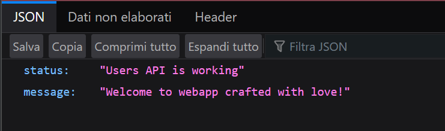

# Node.js con MongoDB

## Disclaimer

La versione presente nel libro utilizzava presentava un bug relativo ad un errore di sintassi della parola 
"mongoose", riferito alla dipendenza presente nel file _index.js_.

Questa versione è aggiornata alla versione 20 di Node.js e testata.

## Installazione

```
docker-compose build

docker-compose up -d
```

Accedere alla pagina http://localhost:8081/api per visualizzare la pagina dell'applicazione:


